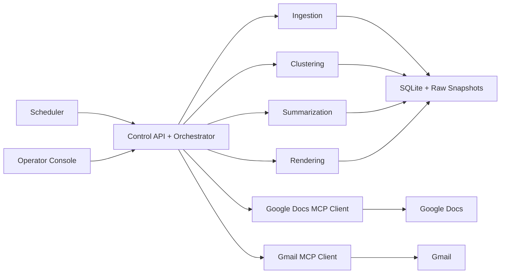

# Weekly Product Review Pulse - Detailed Architecture

## 1. System Goal

The system ingests recent App Store and Google Play reviews for selected
fintech products, clusters and summarizes the feedback into a one-page weekly
insight report, appends that report to a running Google Doc, and notifies
stakeholders by Gmail.

The non-negotiable delivery rule is:

- Google Docs writes happen through a Google Docs MCP server only.
- Gmail draft and send actions happen through a Gmail MCP server only.
- The agent does not call Google Docs or Gmail REST APIs directly for delivery.

## 2. Architectural Principles

- Google Doc is the system of record. Stakeholders read the canonical report in
  Google Docs, not in the dashboard and not only in email.
- MCP is the delivery boundary. Local code can ingest, reason, render, and
  orchestrate, but stakeholder-visible Google Workspace actions must go through
  MCP.
- Operator visibility is separate from stakeholder delivery. The internal
  operator console exists to inspect status and trigger flows; it does not
  replace the Google Doc as the business artifact.
- Every run is idempotent and auditable. Re-running the same product and ISO
  week must not duplicate Google Doc sections or Gmail sends.
- Storage is durable enough to recover. SQLite plus persisted artifacts support
  retries, audit trails, and stage skipping.

## 3. Major Components

| Component | Responsibility |
| --- | --- |
| Next.js operator console | Internal dashboard for readiness, phase completion, recent runs, and manual triggers |
| FastAPI control API | Serves dashboard data, exposes trigger endpoints, and reports completion/readiness state |
| CLI and orchestrator | Runs phase-by-phase workflows, weekly batches, retries, and recovery logic |
| Ingestion modules | Pull App Store RSS and Google Play reviews, scrub PII, deduplicate, and persist raw review data |
| Clustering pipeline | Filter text, embed reviews, form clusters, persist representatives and keyphrases |
| Summarization pipeline | Generate grounded themes, validated quotes, and action ideas |
| Rendering pipeline | Build Docs-ready report payloads and Gmail teaser payloads |
| Docs MCP client | Resolve or create the product Doc, append one weekly section, and return deep-link metadata |
| Gmail MCP client | Create or update a draft, and optionally send once gated |
| SQLite and artifacts | Persist runs, reviews, themes, deliveries, raw snapshots, render payloads, and orchestration summaries |

## 4. High-Level Flow

## 5. Runtime Boundaries

### 5.1 Frontend

The operator console is a Next.js application intended for Vercel deployment.
It does three things:

- reads `/api/overview`, `/api/runs`, and `/api/jobs`
- shows completion and readiness state
- lets operators trigger a per-product run or a weekly batch

This console is for internal operations only. It is not the stakeholder-facing
reporting surface.

### 5.2 Backend

The backend is a Python application that exposes:

- CLI commands through `pulse`
- a FastAPI control API through `pulse serve`
- the orchestration pipeline for single-product and weekly runs

The same backend process family owns ingestion, clustering, summarization,
rendering, publish logic, locking, telemetry, and audit persistence.

### 5.3 MCP Delivery Layer

The backend talks to Google Workspace through MCP clients under
`agent/mcp_client/`.

Important implementation detail:

- the current MCP transport is stdio-based
- the backend launches the configured MCP server command as a subprocess
- therefore `PULSE_DOCS_MCP_COMMAND` and `PULSE_GMAIL_MCP_COMMAND` must point
  to commands that actually exist in the backend runtime

This matters for deployment. If a chosen MCP server depends on Node, Bun, or a
custom binary, that runtime must be present in the Render backend container.

## 6. Storage And Artifacts

The system persists state in SQLite and in artifact directories.

Core tables:

- `products`
- `reviews`
- `review_embeddings`
- `clusters`
- `themes`
- `runs`
- `deliveries`

Key artifact directories:

- `data/raw/<product>/<run_id>.jsonl`
- `data/cache/embeddings/`
- `data/artifacts/render/<product>/<run_id>.json`
- `data/artifacts/orchestration/<product>/<run_id>.json`

These persisted artifacts support:

- deterministic reruns
- auditability
- stage skipping
- partial recovery after failure

## 7. Idempotency And Recovery Rules

### Google Docs

- one running Google Doc per product
- one weekly section per product plus ISO week
- stable machine key line, for example `Run key: pulse-...`
- if the anchor already exists, Docs publish is a no-op

### Gmail

- one canonical draft or send path per product plus ISO week
- deterministic subject and idempotency key
- Gmail send is gated behind `PULSE_CONFIRM_SEND=true`
- Gmail should not send until Docs publish has produced or confirmed the target
  section

### Orchestration

- lock by product plus ISO week
- reuse the latest stored run for the same product plus week when appropriate
- skip stages that already have valid artifacts
- recover Gmail independently when Docs already succeeded

## 8. Deployment Topology

Recommended topology:

- backend on Render from the repository root
- persistent Render disk mounted to `/app/data`
- frontend on Vercel with the project root set to `frontend`

Environment responsibilities:

- Render stores backend runtime variables such as MCP commands, timeouts,
  OpenAI settings, CORS, and send gating
- Vercel stores `NEXT_PUBLIC_API_BASE_URL`
- Google OAuth and Workspace permissions belong to the MCP server
  configuration, not this agent codebase

## 9. Current Workspace Status

Audit date: 2026-04-23

What is verified locally in this workspace:

- backend lint passes
- backend typing passes
- backend tests pass
- frontend lint passes
- frontend production build passes
- operator API responds to `/health` and `/api/overview`

What is not yet verified live in this workspace:

- no Docs MCP delivery has been recorded in `deliveries`
- no Gmail MCP delivery has been recorded in `deliveries`
- `.env` values for Docs and Gmail MCP commands are not present here

That means:

- phases 0 to 4 are complete and locally validated
- phases 5 to 7 are code-complete, but not yet end-to-end complete in this
  workspace because live MCP-backed Google delivery has not been observed

## 10. Final Architecture Rule

The correct end state is:

- AI agent for ingestion, reasoning, rendering, and orchestration
- Google Docs append through Google Docs MCP only
- Gmail draft and send through Gmail MCP only
- an internal operator console for status and triggers
- Google Docs as the stakeholder system of record

Mocks are acceptable for tests. They are not sufficient to declare the full
system complete end to end.
